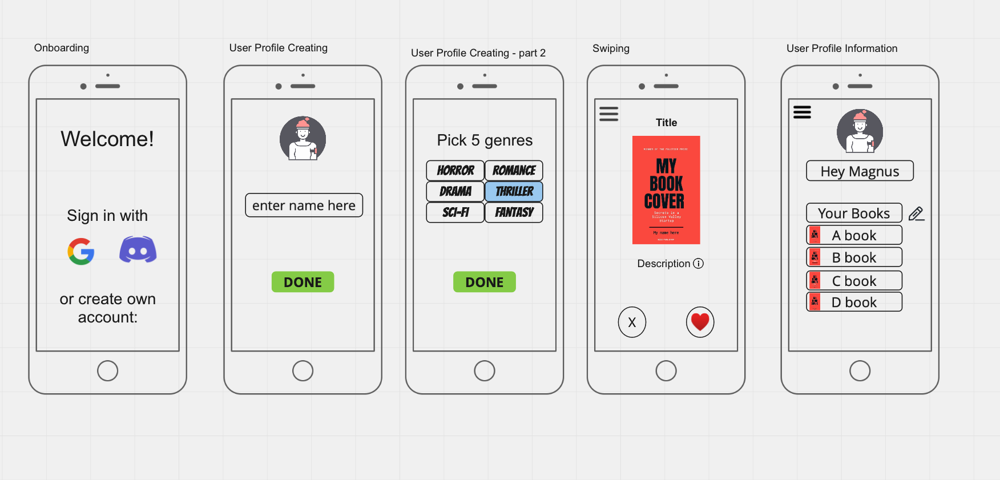

# What is Binder?

Tinder for books. You get suggestions of books and you swipe left or right in order to add the suggested book to your list.

## Authors

- Emil Lantz, 77314
- Mattias Arvidsson, 77973
- Elvira Dzidic, 77673 
- Simon Döbele, 121732

# How to setup?

1. Clone the project.
2. Make sure you have Node.js installed. https://nodejs.org/en/
3. Cd into project folder.
4. Run ```npm install```to initiate.
5. Run ```npm run dev```to serve the app locally.


## Mockup


https://miro.com/app/board/uXjVOIKRW6w=/

## What we have done
Currently, we have built the (Binder)Model, connection from the model to firebase through an observer, implemented an API call for showing a first array of books, are able to save that API data to firebase. Plus, we built the following views (and associated presenters):

### Login View (called "Onboarding" in the mockup)
- The user can sign in with username and password credentials (which takes the user to his list of liked books).
- The user can choose to sign up, if the user has no account (which takes the user to the User Creation view).

### User Creation View
- The user can enter their username, e-mail and password (not connected to firebase, yet).
- After a first sign-up, the user is taken to the User Creation Genre View.

### User Creation Genre View
- The user is presented with different book genres (or subjects) that he is interested in.
- This view takes the user to the user (profile) info(rmation) view.

### User Info View
- Information about the user (picture, liked books) is presented to the user.

### Swipe View
- The user gets presented with books and gets the options to “like it” or “dislike it”.
- The liked books get added to the liked books list (that can be seen in user info view).

### API
- We are using the following API to get our data: https://openlibrary.org/dev/docs/api/books
- The data currently includes: book title, book cover. 


## What we still plan to do

### Login View (called "Onboarding" in the mockup)
- Enable user sign up through firebase.
- Enable user authentication through firebase.
- Enable user to login even when password was forgotten.

### User Creation View
- The user is able to sign up (with e-mail and password, through firebase).
- The user can add a profile picture.

### User Creation Genre View
- The user can pick out of the genres presented to him in order to get suitable book suggestions in binder.

### User Info View
- The user can delete books from the liked books list.
- (Possibly: The user can look at specific book details, i.e. a kind of details view will be needed).

### Swiping
- The interaction is fun for the user (actual swiping will be enabled for smartphone users and something similarly fun for PC users.)

### API
- The data might in the future include: book description, author(s), book genre / subject.
- If there is time, a second, machine-learning-based translation API could be included to enable non-English users to use the app.


## Our project file structure (with short description/purpose of each file)
```
.
├── public
│   └──  style.css          # our CSS style file
├── src                     
│   ├── apiConfig.js           # API configuration file (currently not used)       
│   ├── binderModel.js         # Our Model for the MVP architecture
│   ├── dishSource.js          # Functions for API calls
│   ├── firebaseConfig.js      # Firebase configuration file
│   ├── firebaseModel.js       # Observer functionality (updates from firebase to model & vice versa)
│   ├── index.html             # (Notifies, if you have Javascript disabled.)
│   ├── resolvePromise.js      # Resolves promises (just like in TW3)
│   ├── utilities.js           # will contain utility functions for the model (currently not used)
│   ├── views                  # THE VIEWS (mostly)
│   │   ├── app.js                     # Displays the different components
│   │   ├── loginView.js               # (see description of the views above - "What we have done")
│   │   ├── navigation.js              # helps navigate at startup (to login view)
│   │   ├── promiseNoData.js           # For user experience (when waiting for promise to be resolved)
│   │   ├── swipeView.js               # (see description of the views above - "What we have done")
│   │   ├── userCreationGenreView.js   # (see description of the views above - "What we have done")
│   │   ├── userCreationView.js        # (see description of the views above - "What we have done")
│   │   └── userInfoView.js            # (see description of the views above - "What we have done")
│   └── vuejs                  # THE PRESENTERS (mostly) 
│       ├── index.js                        # Renders the root & Resolves the initial persistence promise
│       ├── loginPresenter.js               # (Presenter corresponding to the View with same name (MVP architecture))
│       ├── show.js                         # utility for deciding the change to a different view
│       ├── swipeView.js                    # (Presenter corresponding to the View with same name (MVP architecture))
│       ├── userCreationGenrePresenter.js   # (Presenter corresponding to the View with same name (MVP architecture))
│       ├── userCreationPresenter.js        # (Presenter corresponding to the View with same name (MVP architecture))
│       ├── userInfoPresenter.js            # (Presenter corresponding to the View with same name (MVP architecture))
│       ├── VueRoot.js                      # The Vue Root that ties the bindermodel and app together.
│       └── ...                             # (Please ignore the other files, that are still boilerplate code.)
└── ...
```
